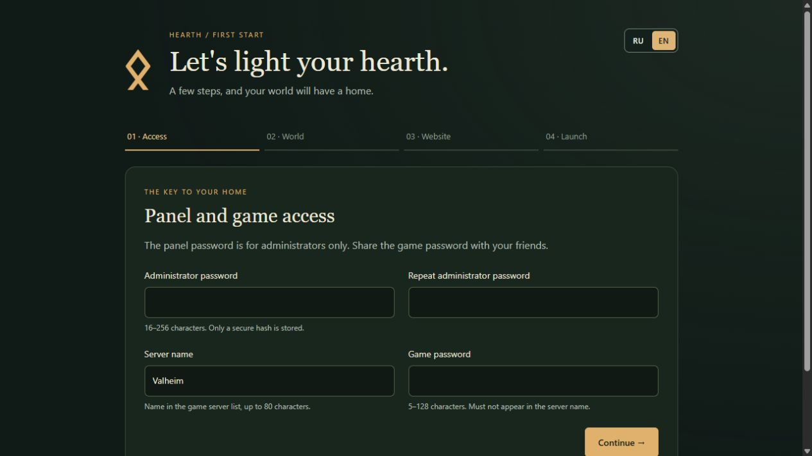
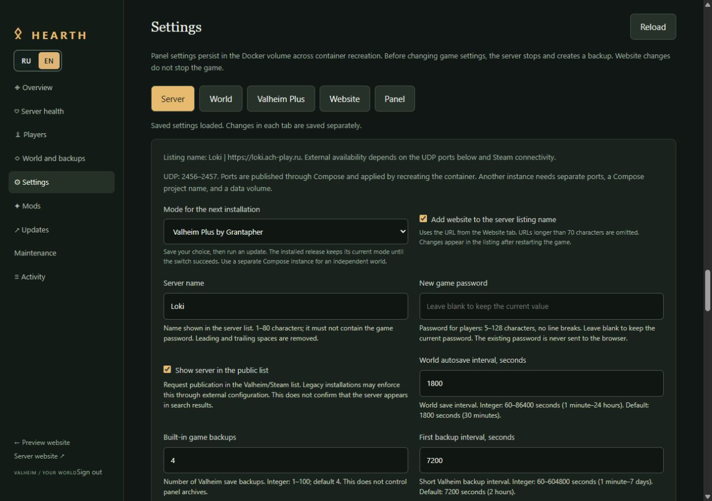
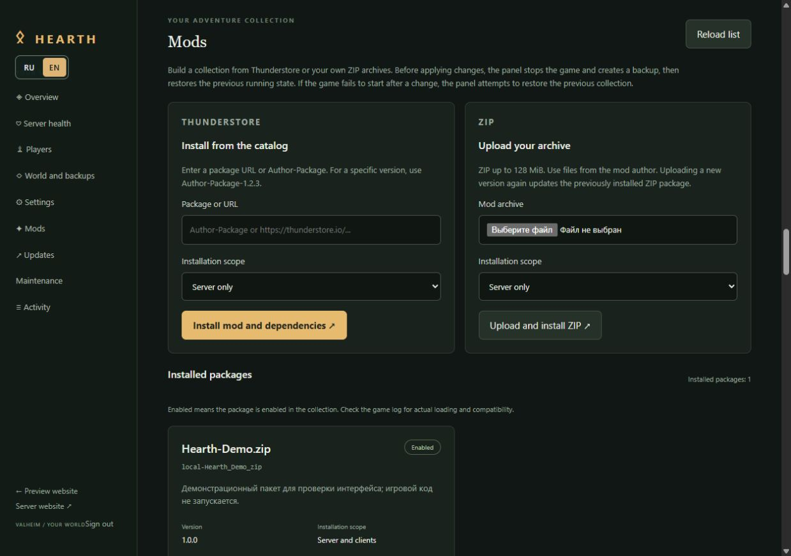
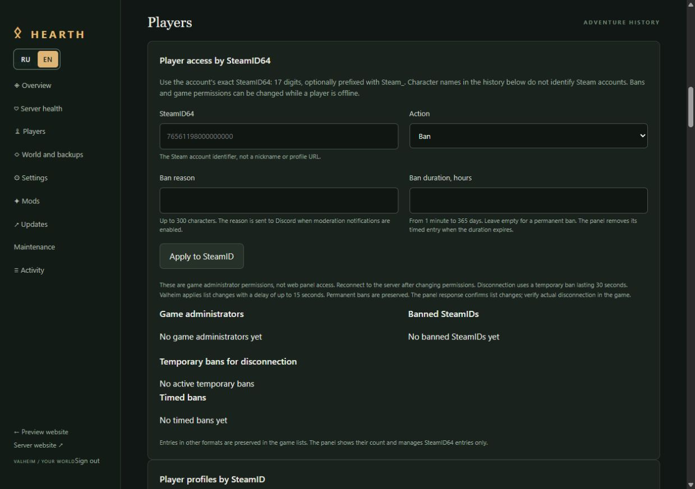
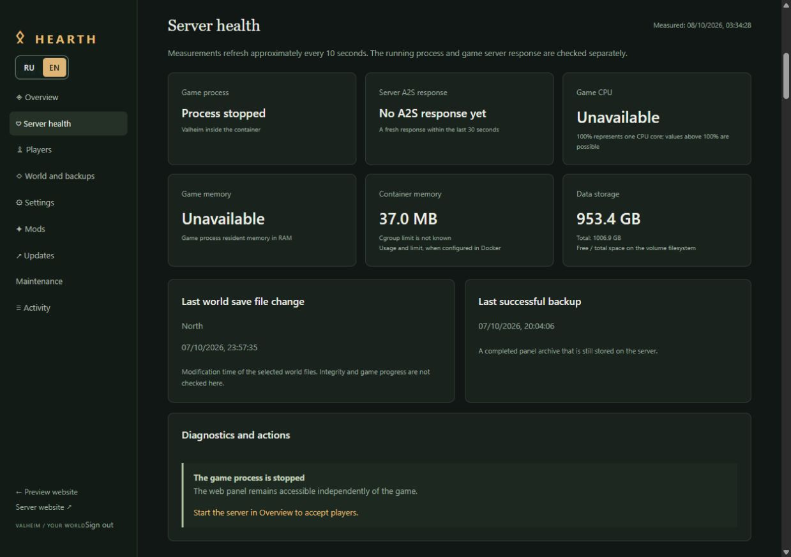
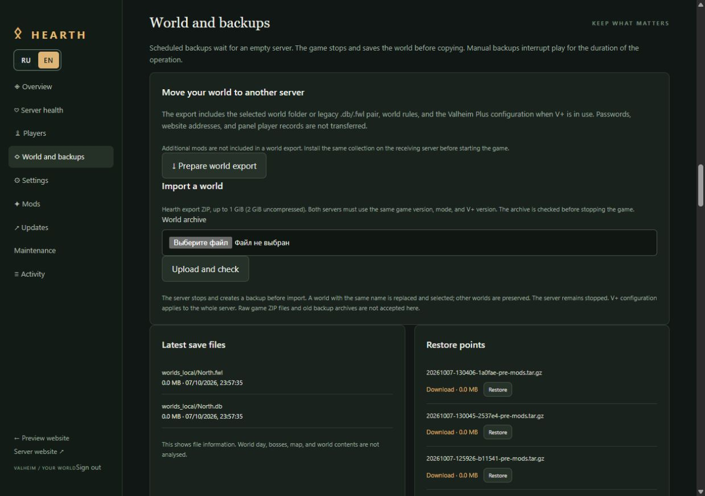
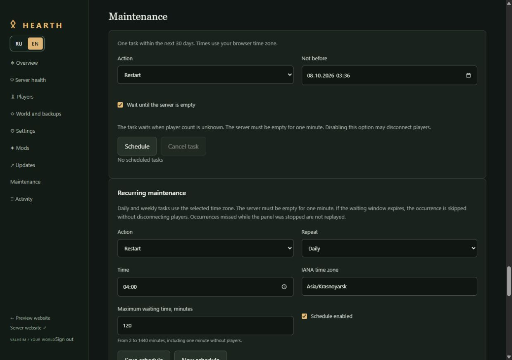
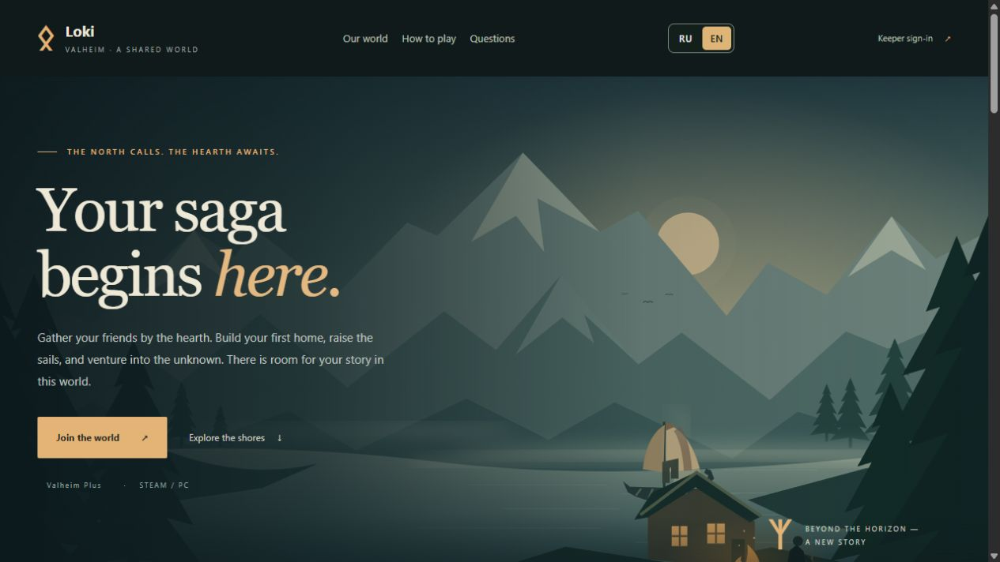
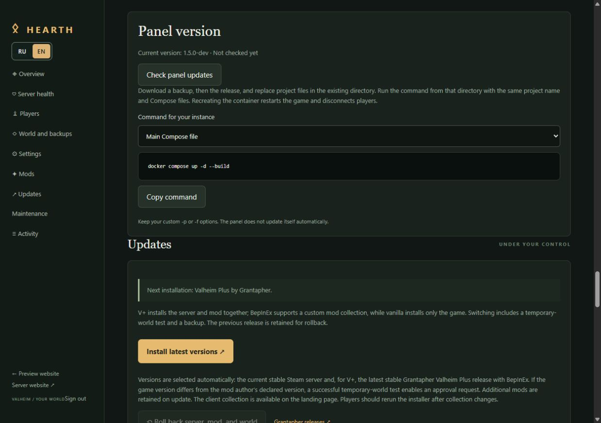

# Hearth — your Valheim server, managed in the browser

[Русский](README.md) · **English**

Hearth gives your Valheim server a home in the browser. Set up a world, invite friends, manage players, and keep backups from one panel, in English or Russian.

Play vanilla, use Grantapher's Valheim Plus, or build your own BepInEx mod set. Players get a separate landing page with connection details and installers for the client mods they need.

[Quick start](#quick-start) · [Features and screenshots](#tour) · [Administration guide](docs/administration.en.md) · [Releases](https://github.com/serya1c/valheim-server/releases) · [Report a problem](https://github.com/serya1c/valheim-server/issues)

<a id="quick-start"></a>
## Get started

You need **Linux x86-64 (amd64)** with Docker Compose, or **Docker Desktop running Linux containers**. A useful starting reserve is **4 CPU cores, 8 GB RAM, and 30 GB of SSD space**; larger worlds, backups, and trial updates need more room.

Download the [project ZIP](https://github.com/serya1c/valheim-server/archive/refs/heads/main.zip) and open its folder, or use Git:

```bash
git clone https://github.com/serya1c/valheim-server.git
cd valheim-server
```

Start Hearth:

```bash
docker compose up -d --build
```

Open [http://localhost:8080](http://localhost:8080). On a remote host, open `http://SERVER_IP:8080` instead. The web interface uses **TCP 8080**. No environment-file template is needed, and the game is not downloaded or started until you finish setup.

The setup wizard walks you through four steps:

1. **Access:** choose the panel password, server name, and a separate game password.
2. **World:** choose vanilla, Valheim Plus, or BepInEx; set the save name and world rules.
3. **Website:** add a title, description, connection address, and community link. You can fill in the public details later.
4. **Start:** choose a backup schedule and create your server. Then sign in to the panel.

> Screenshots below use demo names, addresses, and data. They illustrate the interface, not a live server.



The first game download takes a few minutes. Settings and saves live in the Docker data volume and survive container restarts and rebuilds.

For friends outside your network, open or forward **UDP 2456–2457** on the host; the connection address is `SERVER_IP:2456`. The setup wizard also works through a reverse proxy, but does not configure your firewall, DNS, or HTTPS. See the [administration guide](docs/administration.en.md) for publishing the website through an HTTPS reverse proxy.

<a id="tour"></a>
## A quick look around

| What you want to do | Where to go |
|---|---|
| Start or stop the server and see recent activity | Overview |
| Choose world rules or adjust Valheim Plus | Settings |
| Add Thunderstore or ZIP mods | Mods |
| Ban players or grant in-game admin rights | Players |
| Check resources, make backups, or move a world | Server health / World and backups |
| Schedule work and send Discord notifications | Maintenance |
| Share connection details and client installers | Player landing page |

### Make the world your own

Change the server name, password, visibility, and save interval in **Settings**. Pick world modifiers, use a preset, or adjust supported Valheim Plus settings with explanations beside the controls.

World rules are applied when you enable their management. Choosing a new save name switches to another world; it does not rename the existing save.

Game settings are saved after a graceful stop and a backup; website edits do not interrupt play. The **RU / EN** buttons switch the panel and website language instantly.



### Bring your mods — and help friends install them

Use **Mods** to install packages from Thunderstore or upload a ZIP, manage dependencies, and enable or disable packages. Choose whether each package belongs on the server, on players' computers, or on both.

Enabled client mods are included in the downloadable set on the landing page. The **Windows** and **Linux / Steam Proton** installers use that server's published set and versions. Players run the installer again after you change the set; the game itself is updated through Steam. The installers require the site's HTTPS address on port 443.

Hearth supports **BepInEx 5.4 plugins**; packages requiring separate patchers or native components need another installation method. Before applying mod changes, Hearth stops the game and makes a backup. If startup fails, it attempts to restore the previous mods, world, and configuration. Check each mod's requirements: startup checks cannot guarantee that different mods work together.



### Manage players by SteamID

In **Players**, enter a 17-digit SteamID64, with or without the `Steam_` prefix. Ban or unban a player, set a timed ban and reason, grant or revoke in-game admin rights, or disconnect a player from a running server.

Private aliases, notes, and action history help you remember who is who. In-game admin rights are separate from access to the web panel.

Disconnection uses a short temporary ban and takes effect with a delay while the game reloads its lists.



### Keep an eye on the server

**Server health** separates a running game process from a fresh **A2S statistics reply**. It also shows CPU, memory, free disk space, and the freshness of saves and backups. It helps spot problems; it does not verify the world's contents or guarantee that players can connect.



### Protect your world and take it with you

In **World and backups**, create, download, or restore a backup. Manual backups interrupt play: Hearth stops the game gracefully to save the world, then restarts it if it was running. Keep important copies off the server too.

World export and import support both classic `.db`/`.fwl` saves and chunk-format worlds. The export includes world rules and, for Valheim Plus, its CFG; install additional mod plugins separately on the destination. Follow the [transfer guide](docs/administration.en.md#export-a-world) to check the required game and mod versions first.



### Plan maintenance and stay informed

Schedule a restart, stop, backup, or game update. One-off tasks can wait for an empty server. Daily and weekly tasks always require a fresh player count and **one minute without players**. If their maximum waiting window expires, that occurrence is skipped instead of forcing players offline.

Optional Discord notifications cover selected server, backup, update, maintenance, and moderation events. Ban reasons can be included; private player notes stay in the panel.



### Give your friends one place to go

The public landing page brings together your world description, connection address, community link, and client installation instructions. Customize it in **Settings → Website**.

After setup, players visit `/`; you manage the server at `/admin`. The landing page follows the installed server mode, so vanilla players get vanilla instructions and modded players get the relevant downloads.



## Keep Hearth and the game up to date

There are two separate updates:

- **Game server:** in **Updates**, use **Install latest versions**. Hearth downloads the game and the appropriate loader or Valheim Plus release, checks a trial world, and keeps a backup for rollback. If the game version differs from the one declared by V+, a successful trial allows one-time approval of that pair. Additional mods are retained; check their compatibility with the new game version.
- **Hearth panel:** check the panel version in **Updates** to see the latest release and the suggested command. Update the project files, then rebuild with Docker Compose. The panel does not rebuild itself.



Before upgrading the panel, create and download a game backup. Update the code in the **same project directory**, keeping the **same Compose project name and data volume**. If you use Git, a normal upgrade is:

```bash
git pull --ff-only
docker compose up -d --build
```

Use the same `-p` and `-f` options if your installation uses them. **Never use `docker compose down -v` for an existing world:** it deletes the data volume. Rebuilding Hearth does not automatically update the game.

## Need a little more detail?

- [Administration guide](docs/administration.en.md): HTTPS, backups, world transfers, settings, mods, and troubleshooting.
- [Run a second independent server](docs/administration.en.md#second-instance): its own ports, Compose project, and saves.
- [Releases](https://github.com/serya1c/valheim-server/releases): changes and downloadable releases.
- [Issues](https://github.com/serya1c/valheim-server/issues): report a problem or suggest an improvement.

Hearth is an unofficial community project. Valheim belongs to Iron Gate; [Valheim Plus](https://github.com/Grantapher/ValheimPlus) is maintained by Grantapher. Players need their own Steam copy of Valheim. Crossplay is not enabled in this stack.
