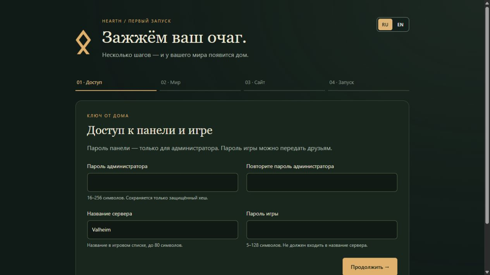
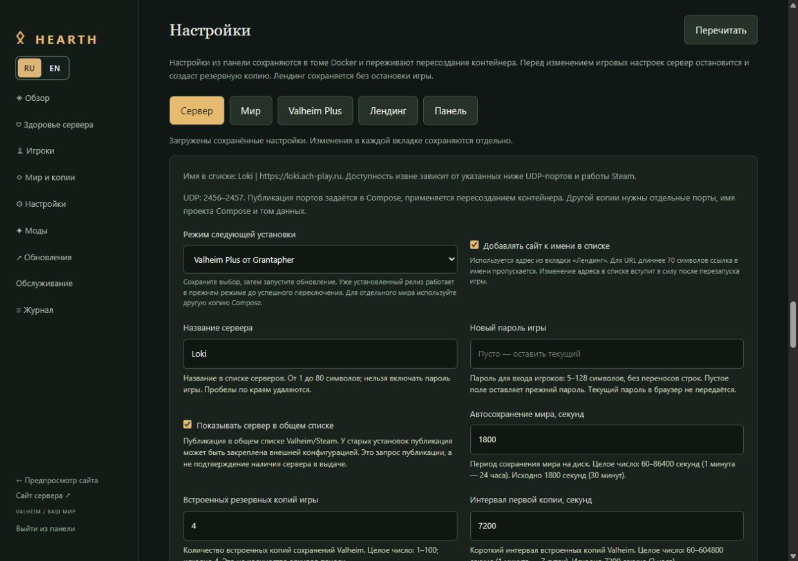
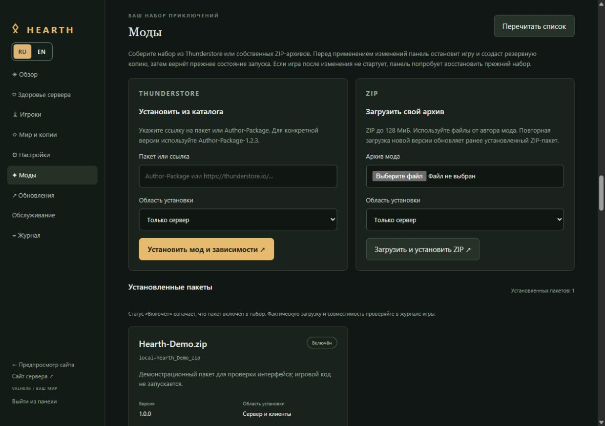
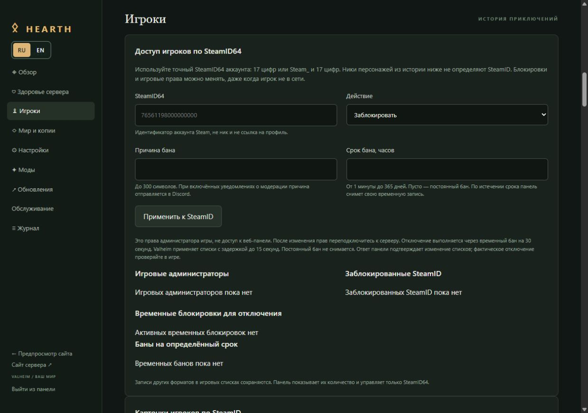
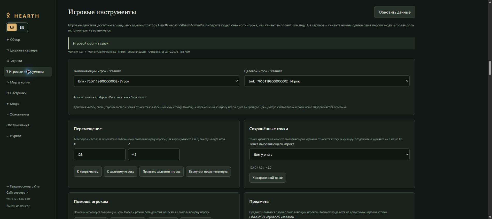
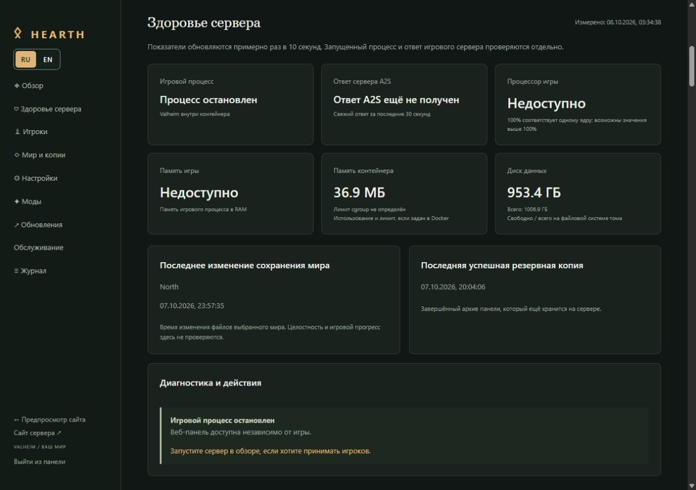
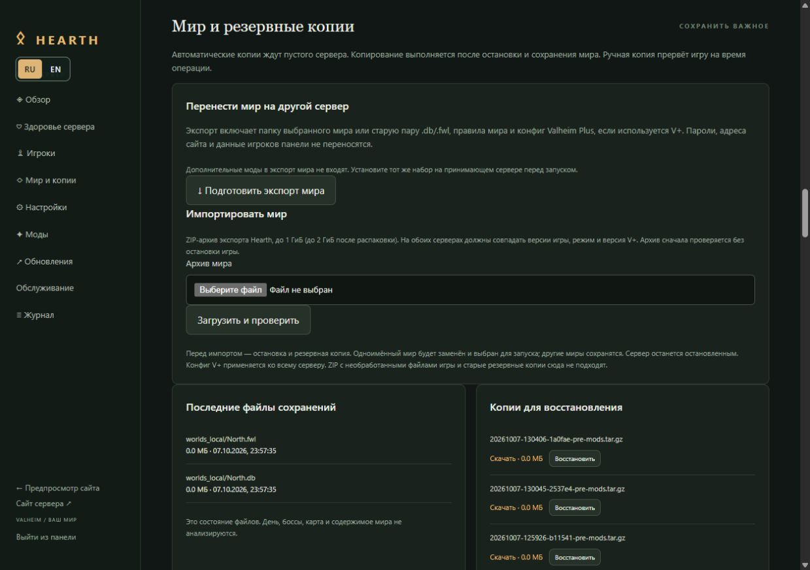
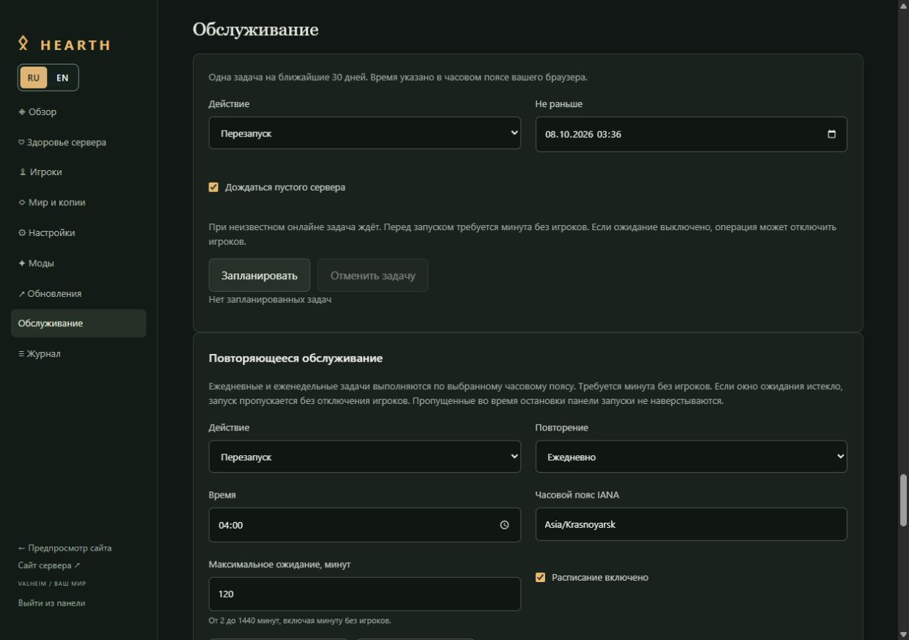
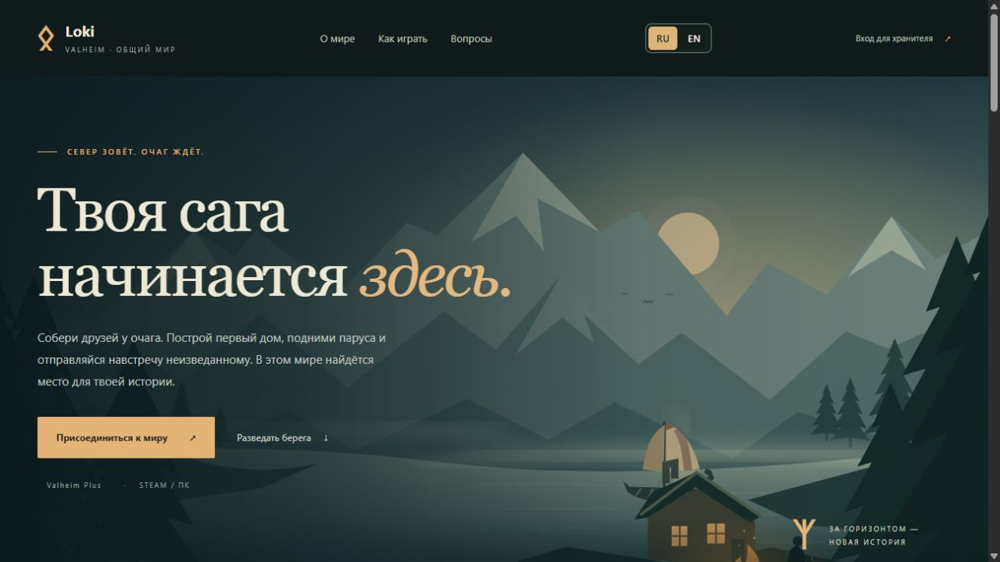
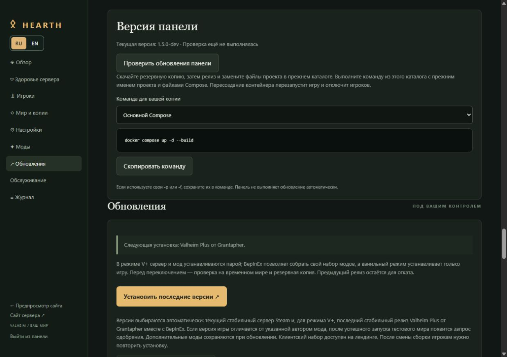

# Hearth — свой сервер Valheim с управлением в браузере

**Русский** · [English](README.en.md)

Соберите друзей у одного очага. Hearth помогает запустить сервер Valheim, настроить мир и моды, сохранить приключения и объяснить игрокам, как подключиться. Всё повседневное управление — в веб-панели на русском и английском.

Выбирайте **ванильный Valheim**, **Valheim Plus от Grantapher** или **свой набор модов BepInEx**. У каждого сервера есть готовый лендинг с адресом подключения и установщиками клиентской сборки.

[Быстрый старт](#quick-start) · [Возможности и скриншоты](#tour) · [Подробное руководство](docs/administration.ru.md) · [Релизы](https://github.com/serya1c/valheim-server/releases) · [Сообщить о проблеме](https://github.com/serya1c/valheim-server/issues)

<a id="quick-start"></a>
## Запустить свой мир

Понадобятся **Docker с Compose** и Linux x86-64 либо Docker Desktop в режиме Linux containers. Для начала удобно иметь около **4 CPU, 8 ГБ RAM и 30 ГБ SSD**. Большому миру, модам, копиям и проверке обновлений может понадобиться больше ресурсов.

Скачайте [ZIP проекта](https://github.com/serya1c/valheim-server/archive/refs/heads/main.zip) и откройте его каталог или используйте Git:

```bash
git clone https://github.com/serya1c/valheim-server.git
cd valheim-server
```

Запустите проект:

```bash
docker compose up -d --build
```

Откройте **[http://localhost:8080](http://localhost:8080)**. На удалённом хосте — `http://IP_СЕРВЕРА:8080` или настроенный домен. Копировать `.env` и редактировать конфиги перед запуском не нужно: мастер проведёт по четырём шагам.

1. **Доступ.** Название сервера, пароль администратора панели и отдельный пароль для игроков.
2. **Мир.** Ванильный режим, V+ или BepInEx, имя сохранения и правила игры.
3. **Сайт.** Название и описание мира, адрес подключения и ссылка на ваше сообщество. Домен можно добавить позже.
4. **Запуск.** Резервные копии и первая установка сервера. После этого войдите в панель и следите за установкой в журнале.



До завершения мастера игра не скачивается и не запускается. Настройки и сохранения живут в томе Docker и переживают пересоздание контейнера.

Для игроков откройте на хосте **UDP 2456–2457**; адрес подключения — `IP_СЕРВЕРА:2456`. Веб-интерфейс использует **TCP 8080**. Домен, HTTPS и правила firewall настраиваются отдельно; мастер доступен и через reverse proxy.

После настройки **`/` — сайт для игроков**, **`/admin` — панель администратора**.

<a id="tour"></a>
## Что умеет Hearth

| Для чего | Что есть в панели |
|---|---|
| Создать свой мир | Настройки сервера, правила мира и редактор Valheim Plus с подсказками |
| Собрать моды | Thunderstore, свои ZIP, зависимости, версии и клиентская сборка |
| Управлять игроками | Баны на срок и навсегда, игровые администраторы, отключение по SteamID |
| Следить за сервером | Онлайн, история подключений, журнал, CPU, RAM и свободное место |
| Беречь прогресс | Резервные копии, восстановление, экспорт и импорт мира с конфигом V+ |
| Обслуживать вовремя | Разовые и повторяющиеся задачи, ожидание выхода игроков, Discord |
| Пригласить друзей | Лендинг, инструкции подключения и установщики Windows / Linux с Proton |

> Скриншоты сняты на локальном демонстрационном стенде. Мир, пакет Hearth-Demo и состояние сервера показаны для знакомства с интерфейсом.

### Настройки с понятными подсказками

Меняйте название, пароль, автосохранение, сложность, ресурсы, рейды и порталы через формы. У параметров есть описания и допустимые значения; для V+ диапазоны показываются, когда они объявлены автором конфига. Сайт и панель настраиваются в отдельных вкладках.

Перед изменением игровых настроек Hearth мягко останавливает игру и создаёт резервную копию. Редактирование лендинга не прерывает игру. Кнопки **RU / EN** мгновенно меняют язык панели и сайта.



### Моды и одинаковая сборка у игроков

Укажите ссылку Thunderstore или `Author-Package` — панель найдёт последнюю версию и нужные зависимости. Можно закрепить версию, загрузить свой ZIP, включать, отключать, обновлять и удалять пакеты.

Вы сами выбираете область установки: **сервер**, **клиенты** или **обе стороны**, по инструкции автора мода. Поддерживаются плагины **BepInEx 5.4**; моды с отдельными patchers или нативными компонентами требуют другого способа установки. Перед изменением набора создаётся копия; при ошибке запуска панель пытается вернуть прежний набор, мир и настройки.



Клиентские моды нужных версий доступны на лендинге. Установщики для **Windows** и **Linux / Steam Proton** находят игру в библиотеках Steam, проверяют сборку сервера и устанавливают её с резервной копией. После изменения сборки игрокам нужно повторить установку.

### Модерация по SteamID

Блокируйте аккаунты на срок или навсегда, указывайте причину, выдавайте игровые права администратора и отключайте игрока. Карточки со своими псевдонимами, заметки и история действий помогают разобраться, кто есть кто. Уведомления о банах можно отправлять в Discord.

Нужен **SteamID64**, а не имя персонажа. Отключение работает через кратковременный бан и применяется игрой с задержкой. Игровая админка не даёт доступа к веб-панели.



### Игровые инструменты и меню F8

В **Моды** установите встроенный **Hearth Admin (ValheimAdminRu)** на сервер и в клиентский набор. В игре меню открывается по **F8**, имеет RU / EN и роли владельца, модератора и строителя. В **Игровые инструменты** администратор Hearth выбирает подключённого исполнителя по SteamID и управляет телепортами, помощью игрокам, спавном, землёй, супермолотом и строительством. Веб-доступ не меняет игровую роль исполнителя.

Нужны BepInEx или Valheim Plus и одинаковая версия мода у сервера и игроков; в ванильном режиме инструменты недоступны. Мод рассчитан на Valheim **1.0.16 / 1.0.17**. Проверка в игре подтверждена сопровождающим проекта перед выпуском Hearth 1.6.0. [Подробнее о правах и сохранении данных](docs/administration.ru.md#hearth-admin).



*Демонстрационный стенд: вымышленные игроки и точки, без подключения к реальной игре.*

### Здоровье сервера

Панель отдельно показывает, **запущен ли процесс** и **отвечает ли сервер на запросы статистики A2S**. Рядом — CPU и память игры, память контейнера, свободное место, время изменения сохранения и последняя успешная копия. При проблеме есть объяснение и действие, с которого можно начать.



### Копии и перенос мира

Создавайте и скачивайте копии, восстанавливайте мир или переносите его на другой сервер Hearth через ZIP. Поддерживаются и старая пара `.db/.fwl`, и новый формат мира с чанками. Для мира с V+ экспорт включает конфиг мода и правила мира; дополнительные плагины переносятся отдельно.

Плановые копии ждут пустого сервера. Ручная копия прерывает игру на время сохранения и архивирования. Важные архивы лучше скачивать на другой диск: один том Docker не защищает от потери хоста.



### Обслуживание и Discord

Запланируйте копию каждый день или перезапуск по вторникам ночью. Выберите часовой пояс и предельное время ожидания. Повторяющиеся задачи ждут минуту без игроков; если окно ожидания истекло, запуск пропускается без их отключения. Календарь показывает ближайшие семь дней.

Добавьте webhook своего Discord-канала и выберите события: доступность сервера, копии, обновления, обслуживание, модерация и ошибки операций. Пароли и заметки модераторов в уведомления не попадают.



### Свой сайт для сообщества

Лендинг рассказывает о мире, показывает адрес, состояние сервера и установленные версии, даёт инструкции и ссылки на установщики. Название, домен, описания на RU / EN и ссылку Discord, Telegram или другого сообщества можно изменить в настройках.

Сайт подстраивает инструкции под установленный режим: ванильным игрокам моды не предлагаются. Для работы установщиков с вашим сервером нужен публичный **HTTPS-адрес на порту 443**. Для поисковиков подготовлены `sitemap.xml`, `robots.txt` и метаданные страниц.



## Обновления без ручного подбора версий

**Игра и V+.** Кнопка «Установить последние версии» скачивает актуальный сервер и, в режиме Plus, мод Grantapher. Кандидат проверяется на временном мире; перед переключением создаётся копия. При ошибке запуска предусмотрена попытка отката. Если версия игры отличается от указанной автором V+, после успешной проверки можно разово одобрить эту пару. Совместимость всех модов и игровых механик всё равно нужно проверять в игре.

**Сама панель.** Hearth проверяет новые релизы и показывает команду обновления для вашей копии. Код проекта обновляете вы; панель не управляет Docker автоматически.



Для обновления панели скачайте резервную копию, обновите файлы проекта в **прежнем каталоге** и выполните:

```bash
docker compose up -d --build
```

Сохраняйте прежнее имя проекта Compose, том данных и свои параметры `-p` / `-f`. Пересоздание контейнера перезапустит игру. **Не используйте `docker compose down -v` для действующего мира: `-v` удаляет данные тома.** Обычное обновление панели не обновляет игру автоматически.

## Когда понадобится больше подробностей

В [руководстве администратора](docs/administration.ru.md) собраны настройка домена и портов, [вторая независимая копия сервера](docs/administration.ru.md#second-instance), обновления и откат, ограничения установщиков, перенос мира и особенности расписаний. [English guide](docs/administration.en.md) содержит те же темы.

Нашли ошибку или есть идея? [Откройте issue](https://github.com/serya1c/valheim-server/issues) и приложите версию панели, описание ситуации и нужный фрагмент журнала без паролей и webhook.

Hearth — неофициальный проект для сообщества. Valheim принадлежит Iron Gate; [Valheim Plus](https://github.com/Grantapher/ValheimPlus) поддерживается Grantapher. Для игры игрокам нужна собственная Steam-копия Valheim; Crossplay в этой сборке не включён.
